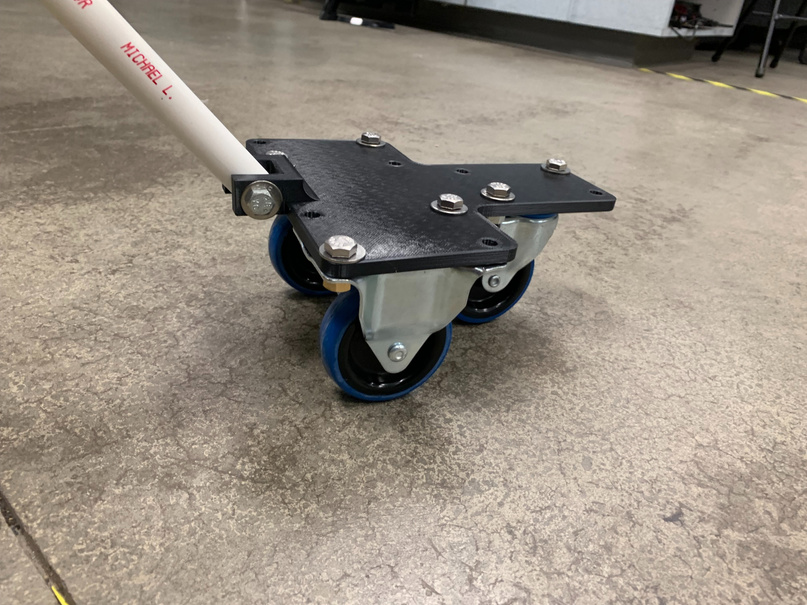

## Why

I needed a low-cost handheld sensor platform that could easily maneuver
sensors under cars.

## What

A PVC pipe serves as the handle and steering rod, with a 3D-printed LCD
display case and PVC mount. The LCD shows real-time sensor readings and an
interactive user GUI, driven by a Raspberry Pi interfaced with the sensors.

The caster plate is 3D printed and bolts the swivel casters to the frame,
keeping the platform stable while it rolls under a vehicle.
